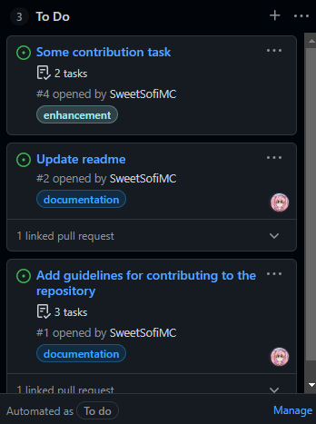
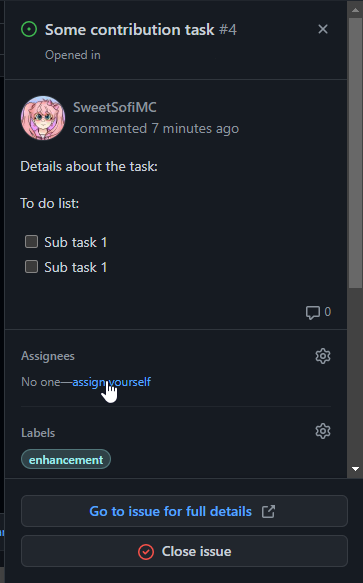
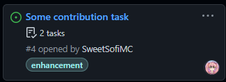
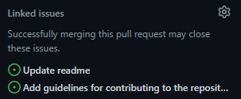

# Contribution guide for collaborators

## I want to contribute, how should I proceed?

This contribution guide will cover how to contribute to the project as collaborators.

- The first thing to do is go to the GitHub Project page for the repository
- Next pick a task in the To Do section of the project that best matches your skills and that you're interested in:
    - Note that you must pick cards that are not assigned to anyone yet.

- Once you're comfortable with your selection, click on the card title and assign yourself in the right sidebar
  
- Your profile picture will now appear on the card
  
- Once you're assigned to a task, you'll create a branch where you'll put all your contributions for the project, but only towards the given task, not any other bug fix nor styling change.
    - The branch's name should be in the form of `major/minor`
    - Major can be a keyword such as:
        - `Documentation`
        - `Feature`
        - `Bugfix` or `Patch`
        - `Styling`
    - Minor can be any short word to describe the task you picked
    - Here are some examples:
        - `feature/navigation-bar`
        - `documentation/running`
        - `patch/issue-6` or `patch/security-fix`
        - `styling/main-server-file`
- You can now start pushing changes into this branch, but please make sure you push every single change, so you don't keep any commits in you local repository for too long, and allowing us we can track the project progress
    - Please also create a **draft** pull request from you branch to `main` before continuing to work on your contributions, to track your changes easily. Please don't forget to follow the format and to assign yourself to that pull request.
    - Inside the draft pull request, link the issue you picked for your task (the same you assigned yourself), here's an example
    
- When you're done with your contributions, please mark the pull request ready for review and assign a Collaborator as reviewer. Your changes will be reviewed and approved if everything works according to your task, otherwise you may be asked to do some changes as comments in the pull request, once you summit those changes into your branch, you can re-ask for a review.

  
*Note: if you're working with another member in the same feature, please be in close communication with them, both can use the same branch, but please update the issue and pull request accordingly (adding your teammate to the assignees list)*